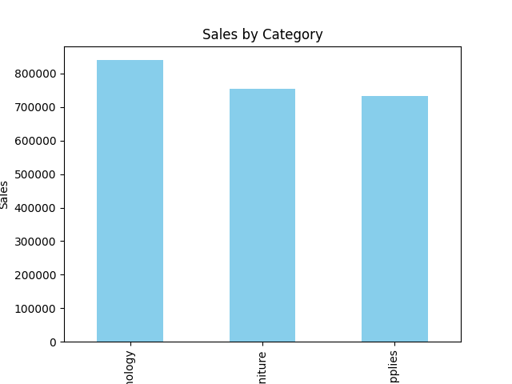
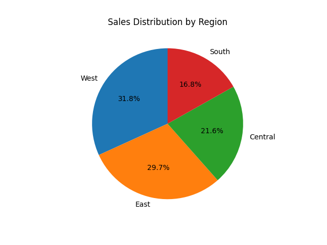
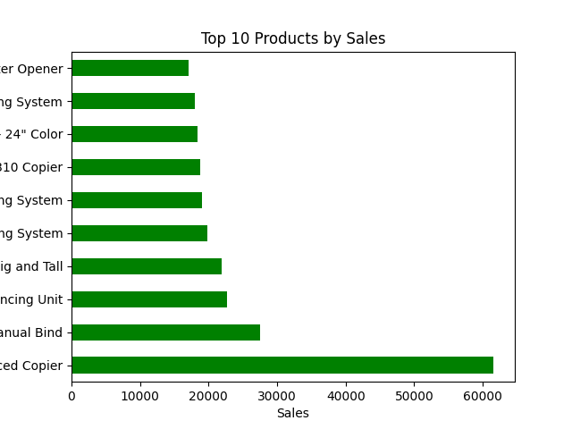
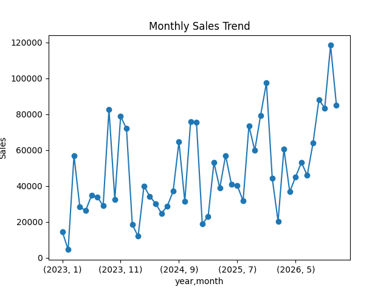

# Sales Analytics Project

## Project Overview

This project analyzes retail sales data to identify key business insights such as revenue trends, regional performance, top-performing products, and category profitability.

The objective of this project is to demonstrate an **end-to-end data analytics workflow**, starting from raw data processing to business insights using Python, SQL, and Tableau.

---

# Technologies Used

### Python (Jupyter Notebook)

Python was used for **data cleaning, preprocessing, and exploratory data analysis**.

Libraries used:

* **Pandas** – Data cleaning and transformation
* **Matplotlib** – Data visualization

Tasks performed in Python:

* Loaded the raw dataset
* Checked for missing values
* Removed duplicates
* Standardized column names
* Created new features such as:

  * Year
  * Month
  * Profit Margin
* Performed exploratory data analysis
* Generated visualizations

The analysis was conducted inside a **Jupyter Notebook**.

Notebook file:

```
Notebook/sales_analysis.ipynb
```

---

### SQL (MySQL)

SQL was used to perform **business-level queries** on the cleaned dataset.

Tasks performed using SQL:

* Created a database
* Created the sales table
* Loaded the cleaned dataset into MySQL
* Performed analytical queries including:

  * Total Sales
  * Total Profit
  * Sales by Region
  * Sales by Category
  * Top 10 Products
  * Monthly Sales Trends
  * Profit analysis

SQL script location:

```
sql/sales_analysis.sql
```

---

## Tableau Visualization

Tableau was used to create visualizations that help analyze sales patterns and business performance.

The Tableau workbook contains visualizations such as:

- Sales by Category
- Sales by Region
- Top 10 Products by Sales
- Monthly Sales Trend

Tableau File:

```
dashboard/sales_dashboard.twb
```
---

# Dataset

The dataset used in this project is the **Superstore Sales dataset**, which contains retail transaction records including:

* Order details
* Customer information
* Product categories
* Sales and profit values
* Shipping details
* Geographic regions

The raw dataset was first cleaned and prepared using Python before performing further analysis.

---

# Project Workflow

Raw Dataset
↓
Data Cleaning (Python – Pandas)
↓
Exploratory Data Analysis (Python – Jupyter Notebook)
↓
Business Queries (SQL – MySQL)
↓
Data Visualization (Tableau / Charts)

---

# Business Questions

The analysis focuses on answering the following key questions:

* What is the **total sales revenue and total profit**?
* Which **regions generate the highest revenue**?
* Which **product categories perform best**?
* What are the **top selling products**?
* How do **sales change over time**?

---

# Visualizations

### Sales by Category



### Sales by Region



### Top 10 Products by Sales



### Monthly Sales Trend



---

## Tableau Visualizations

### Sales by Category


### Sales by Region


### Top 10 Products by Sales


### Monthly Sales Trend


# Project Structure

```
Sales-Analytics
│
├── Data
│   ├── raw
│   │   sample_superstore.xls
│   │
│   └── cleaned
│       sales_cleaned.csv
│
├── Notebook
│   └── sales_analysis.ipynb
│
├── sql
│   └── sales_analysis.sql
│
├── Visuals
│   ├── monthly_sales.png
│   ├── sales_by_category.png
│   ├── sales_region_pie.png
│   └── top_products.png
│
├── dashboard
│
├── index.html
├── style.css
└── README.md
```

---

# Key Insights

Some important insights discovered from the analysis:

* The **West region generates the highest sales revenue**
* **Technology products** contribute the most to overall sales
* A **small number of products account for a large portion of revenue**
* Sales trends show consistent activity across months

---

# Author

**Bindhu Saahithi**

Master’s Student – Data Science
Aspiring Data Analyst
